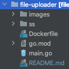
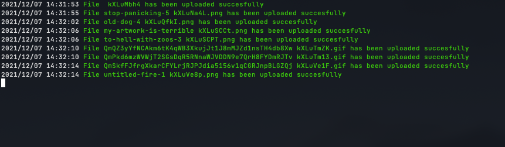
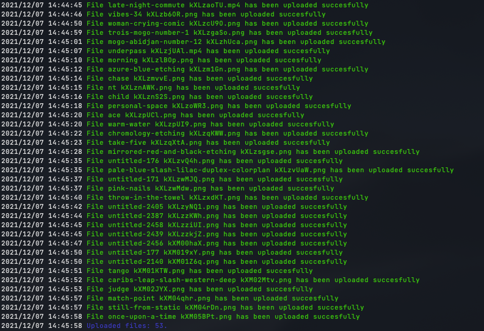

## FILE UPLOADER CLI

### The task
An application that uploads a local folder and its contents to a users' `put.io` account.

## Architecture Decision

At first I decided to develop a web application where the files are provided through `html forms`. Then I thought
that it would be less efficient considering `Docker`. I am confused, I thought, if it's a web application and it should let 
users to choose the files they want, and since the app is going to be containerized, I couldn't find a way to carry
folders to `docker container` and reach them with the code. So, I just write a simple program. It uses the default folder provided by the `put.io` called `images` unless
it's specified by the user within command line. Folder and its content is also stored inside `docker container`. Hence, the binary
of the application can reach the folder and its content.

I utilized the concurrency
using `goroutines` with `worker pool` concept. A fixed number of worker goroutines are started. The work distributed
according to the files that are read. I wasn't sure about the number of workers to run and I did check the
`put.io`'s API documentation but could not find anything related to how many concurrent API operations does it
reasonably expected to support. Hence, I decided to use 20 workers.

I did write the `dockerfile` as multi-stage to reduce the image size. With the second `alpine` image it significantly
reduced the size of the image from `~1.5`GB to ~`370`MB.

I did not upload the `images` folder to GitHub, since, it will take too much time to upload and download. It should be copied under the root directory. 

## Assumptions

#### Assumed that

* The files are regular files considering the folde provided by `put.io`.
* The files' size is less than 150MB.

### Utilized Tools
* Go

    I did use the programming language called Go. Right now, Go is the most comfortable programming language to write code with for me.

* Goland

    I used Goland as an IDE for the application, since, it provides many features and has an ergonomic environment for Golang.

* Docker

    Docker is used to containerize the Go application and runs it everywhere due to its operating system level virtualization.

### External Packages

* Put.io API

    The API is used to access `put.io`'s functionalities. 

* Oauth2

    Oauth2 is utilized to make authorized and authenticated HTTP requests along with the user's token.


### Quickstart

1. Clone the repository into your local environment

```
git clone https://github.com/bariis/file-uploader.git
cd file-uploader
```
2. `image` folde provided by `put.io` should be copied inside the directory. The structure of the directory should be as below image.



3. Build the docker image based on dockerfile.

```
docker build -t file-uploader .
```

4. Run the image as a container
* Token should be provided by the user.
```
docker run -it --rm file-uploader -token={$token}
```

# Screenshots






